# Virtual Try-On (VTO) Application

**Virtual Try-On (VTO)** is a comprehensive Android application designed to revolutionize the fashion and beauty experience. It leverages advanced AI (SAM2, Gemini, Kling AI) and AR (Banuba) technologies to provide a seamless "try-before-you-buy" experience, digital wardrobe management, and intelligent outfit planning.

**Disclaimer:** This application provides AI-supported fashion advice and visualization. It is a Final Year University Project intended for educational and demonstration purposes.

## Features

### 1. Authentication & User Profile
*   **Secure Sign-In:** Robust authentication using **Firebase Authentication**.
*   **Onboarding:** Personalized flow to capture user style preferences, sizes, and details.
*   **Cloud Sync:** Real-time synchronization of user profiles via **Firebase Firestore**.

### 2. Smart Wardrobe Management
*   **Digital Closet:** Users can upload images of their own clothing.
*   **Advanced Segmentation Integration:**
    *   **GroundingDINO:** Automatically detects clothing regions in raw images.
    *   **SAM2 (Segment Anything Model 2):** Removes backgrounds with varying complexity to create clean, isolated clothing items.
*   **Gemini-Powered Categorization:**
    *   Uses **Google Gemini 2.5 Flash** to automatically analyze clothing images within the app.
    *   Extracts metadata: *Category, Color, Pattern, Style, and Occasion*.
    *   Generates "Smart Names" (e.g., "Casual 1", "Formal 2") based on occasion and style.

### 3. Virtual Try-On (VTO)
*   **Clothing VTO (Kling AI):**
    *   Integration with **Kling AI (Kolors Virtual Try-On)** API.
    *   Merges user photos with segmented clothing items to generate highly photorealistic try-on results.
*   **AR Makeup (Banuba SDK):**
    *   **Real-time Effects:** Lipstick, Foundation, Eyeshadow, Eyelashes, Eyeliner, Eyebrows, Teeth Whitening, Soft Light.
    *   **Live Camera & Photo Mode:** Supports both real-time camera feed and static photo editing.
    *   **Detailed Customization:** Adjust intensity and styles for each effect (e.g., "Classic Red Glam" lips, "Volume Lashes").

### 4. Event & Outfit Planner
*   **Outfit Scheduling:** Link specific saved outfits to upcoming calendar events.
*   **Smart Notifications:** Automated reminders via **Android WorkManager** ensure users are prepared for their events.

## Tech Stack

### Android (Client)
*   **Language:** Kotlin
*   **UI Framework:** Jetpack Compose (Material 3)
*   **Architecture:** MVVM (Model-View-ViewModel)
*   **Networking:** Retrofit / OkHttp
*   **Asynchronicity:** Kotlin Coroutines & Flow
*   **Image Loading:** Coil
*   **AR Engine:** Banuba SDK

### Backend & Cloud Services
*   **Firebase:** Authentication, Firestore, Storage.
*   **Kling AI API:** External service used for generating the final Virtual Try-On (VTO) images.
*   **Local Python Servers (FastAPI):**
    *   **Segmentation (Port 8080):** Runs GroundingDINO & SAM2.
    *   **Metadata (Port 8000):** Runs Google Gemini 2.5 Flash.

## Prerequisites

*   **Android Studio:** Latest version recommended.
*   **JDK:** Version 11 or higher.
*   **Python 3.8+:** For running local AI servers.
*   **Firebase Project:** With Auth, Firestore, and Storage enabled.
*   **Banuba SDK Token:** Required for AR features.
*   **Kling AI API Access:** `ACCESS_KEY` and `SECRET_KEY` required.
*   **Google Gemini API Key:** Required for `image_to_text.py`.

## Setup & Installation

### 1. Python Backend Setup
The app requires **two** local Python servers to be running.

**A. Segmentation Server (SAM2):**
1.  Navigate to `app/src/main/java/com/TOTOMOFYP/VTOAPP/repositories/segmentation.py`.
2.  Install dependencies: `pip install fastapi uvicorn torch torchvision transformers opencv-python numpy` (and SAM2 implementation).
3.  Run the server:
    ```bash
    python segmentation.py
    # Runs on http://0.0.0.0:8080
    ```

**B. Metadata/Categorization Server (Python):**
1.  Navigate to `app/src/main/java/com/TOTOMOFYP/VTOAPP/repositories/`.
2.  **Configuration (.env):**
    *   Create a file named `.env`.
    *   Add your Google Application Credentials path:
        ```env
        GOOGLE_APPLICATION_CREDENTIALS="./your-service-account-file.json"
        ```
    *   Ensure your valid Firebase Admin SDK JSON file is present in the directory.
3.  Install dependencies: `pip install fastapi uvicorn google-genai google-cloud-firestore google-cloud-storage python-dotenv`.
4.  Run the server:
    ```bash
    python image_to_text.py
    # Runs on http://0.0.0.0:8000
    ```

### 2. Android App Setup

1.  **Clone the Repository:**
    ```bash
    git clone <repository-url>
    cd VTO
    ```
2.  **Firebase Configuration:**
    *   Place `google-services.json` in the `app/` directory.
3.  **Secure Keys Configuration (Important):**
    *   Create a file named `local.properties` in the project root (if it doesn't exist).
    *   Add your API keys and tokens here. This file is ignored by Git to protect your secrets.
    ```properties
    # Banuba SDK Token
    BANUBA_TOKEN="your_very_long_banuba_token_string"

    # Kling AI API Keys
    KLING_ACCESS_KEY="your_kling_access_key"
    KLING_SECRET_KEY="your_kling_secret_key"
    ```
    *   **Note:** The app will fail to build if these values are missing.
5.  **API Configuration:**
    *   Open `app/src/main/java/com/TOTOMOFYP/VTOAPP/repositories/ApiClient.kt`.
    *   Update `segmentationApiUrl` and `categorizationApiUrl` to point to your machine's IP address (e.g., `http://192.168.1.X:8080` and `http://192.168.1.X:8000`).
6.  **Build & Run:**
    *   Open in Android Studio, sync Gradle, and run on a physical device.

## Architecture

The app follows the recommended **MVVM** architecture:

*   **Data Layer:**
    *   `ApiClient` (Segmentation/Gemini).
    *   `KlingAIVirtualTryOn` (VTO Generation service).
*   **Domain Layer:** `auth/`, `events/`, `makeup/` modules.
*   **UI Layer:** `ui/` contains Jetpack Compose screens.

## Structure Overview
```
com.TOTOMOFYP.VTOAPP
├── auth/           # Login, Register, User Info
├── repositories/   # ApiClient, Python Scripts, Kling AI Service
├── ui/
│   ├── components/ # Reusable UI 
│   ├── events/     # Event Planner & Notifications
│   ├── home/       # Dashboard
│   ├── makeup/     # Banuba AR & Makeup Storage
│   └── wardrobe/   # Wardrobe Management
├── BanubaActivity  # AR Camera Activity
└── MyApplication  # App Init
```

## Demo
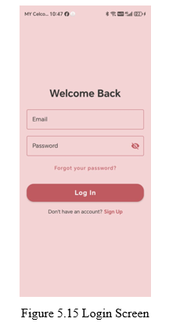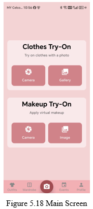
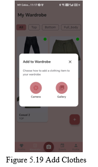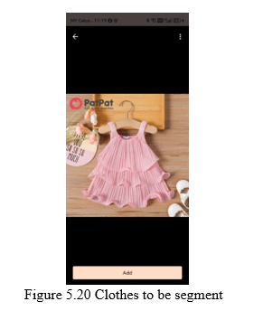
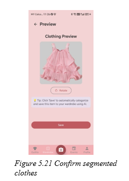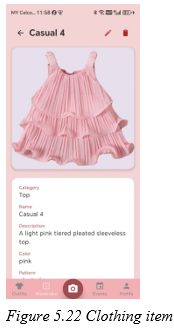
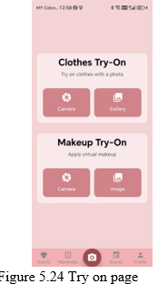
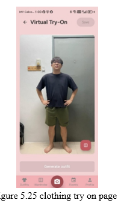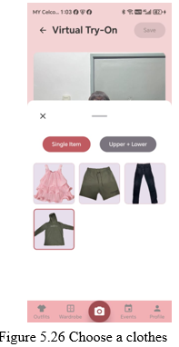
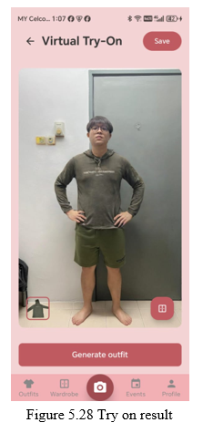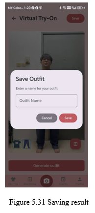
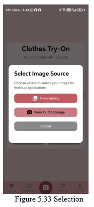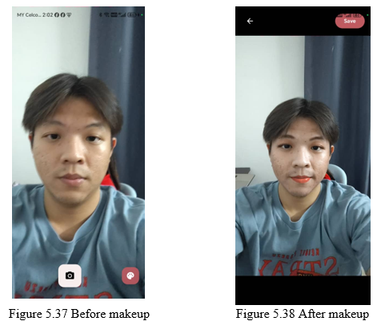
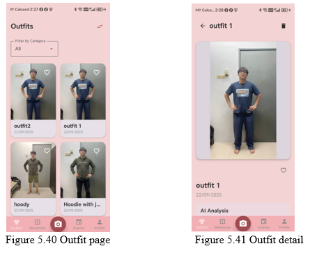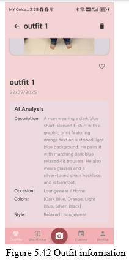
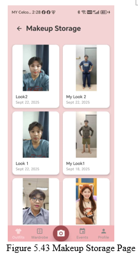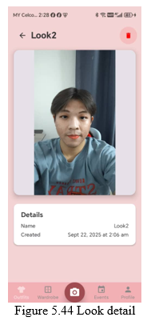
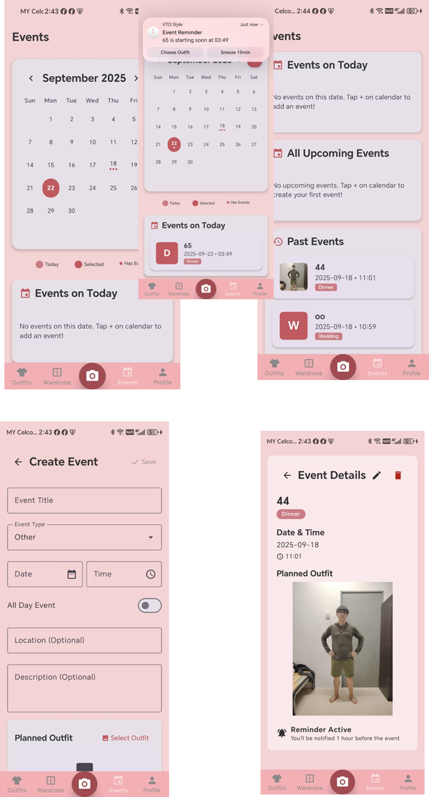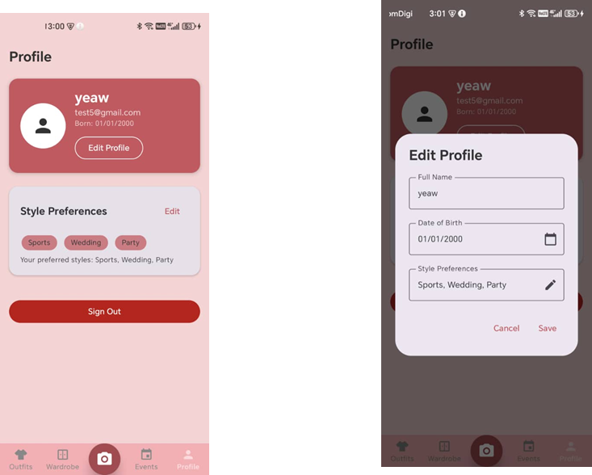